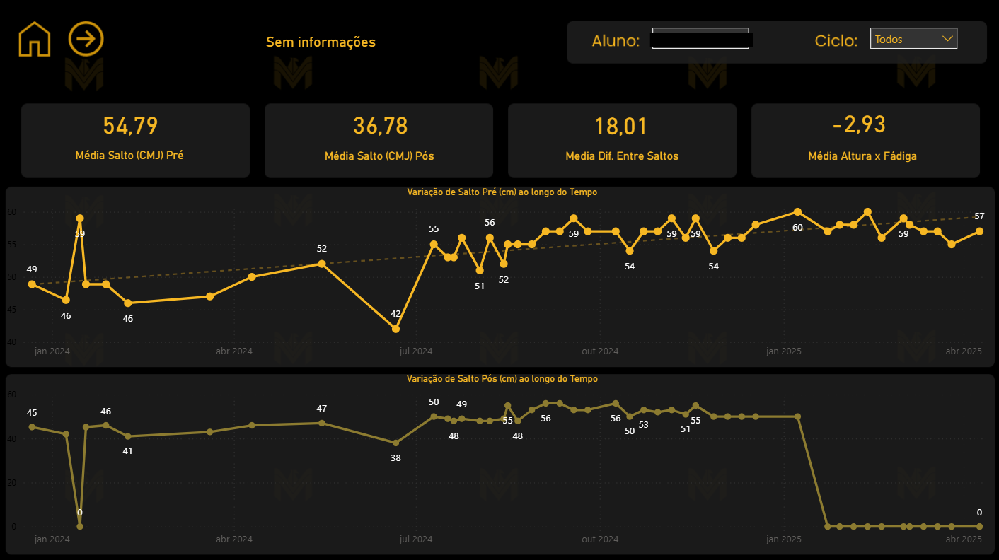
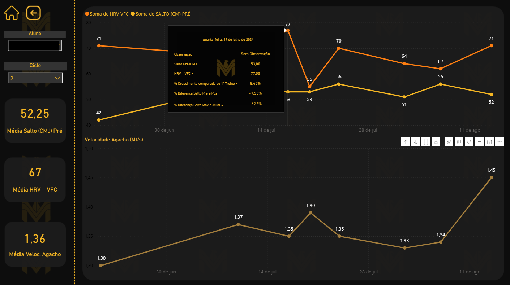

[README.md](https://github.com/user-attachments/files/25527874/README.md)
# 🏃‍♂️ Análise de Performance em Treinamento Esportivo — BI

Projeto de Business Intelligence focado na estruturação de dados de treinamentos de alta performance, automação do processo de ETL e desenvolvimento de dashboard analítico para acompanhamento da evolução de atletas.

---

## 🎯 Contexto

O cliente possuía dados de treinamentos esportivos sem padronização adequada para análise em BI, dificultando o acompanhamento da evolução dos atletas ao longo dos ciclos de treinamento.

Além disso, a estrutura original não permitia análises comparativas consistentes entre treinos, ciclos e atletas.

O projeto teve como objetivo estruturar os dados, automatizar o tratamento das informações e construir um dashboard confiável para apoio à tomada de decisão.

---

## 🔄 Preparação e Qualidade dos Dados

### 📊 Organização inicial (Excel)

- Criação de tabelas individuais por atleta com formatação padronizada  
- Inserção dos dados históricos na nova estrutura  
- Análise exploratória (EDA) para validação da qualidade dos dados  
- Pré-ETL para normalização dos campos  

---

## ⚙️ ETL no Power BI

O processo de ETL teve maior complexidade devido à lógica de ciclos de treinamento.

### 🧩 Regras de negócio

- Cada ciclo possui duração de **8 semanas**  
- A quantidade de treinos por atleta varia (4, 8 ou 16 treinos por ciclo)  
- Cada treino possui identificador único por atleta  

Para suportar a análise, foram realizadas as seguintes etapas:

- Criação da dimensão de alunos  
- Criação da tabela de ciclos  
- Consolidação das tabelas individuais em uma **tabela fato geral de treinos**  
- Tratamento de valores nulos e validações automáticas  
- Padronização dos campos para consumo analítico  

---

## 🧠 Desafio Técnico

### Ambiguidade na identificação dos ciclos

Inicialmente, os ciclos eram numerados apenas como:

```
1, 2, 3, 4...
```

Isso gerava ambiguidade, pois diferentes atletas possuíam ciclos com a mesma numeração.

### ✅ Solução aplicada

Foi criada uma **chave composta (Aluno + Número do Ciclo)** para garantir unicidade na identificação dos ciclos.

**Impactos da solução:**

- eliminação de ambiguidade nos relacionamentos  
- viabilização de cálculos comparativos por ciclo  
- funcionamento correto dos filtros de Aluno e Ciclo  
- maior confiabilidade do modelo analítico  

A chave composta foi incorporada à tabela fato geral para suportar as medidas do relatório.

---

## 🎨 Prototipação

Antes do desenvolvimento, foi criada a prototipação do dashboard utilizando Figma e PowerPoint, garantindo:

- layout limpo e intuitivo  
- aderência à identidade visual do cliente  
- validação prévia com o cliente  

---

## 📊 KPIs Desenvolvidos

- Média Salto (CMJ) Pré  
- Média Salto (CMJ) Pós  
- Média Diferença entre Saltos  
- Média Altura x Fadiga  
- Média HRV - VFC  
- Média Velocidade do Agacho  

---

## 🧮 Principais Medidas DAX

Abaixo estão algumas das principais medidas utilizadas no dashboard para construção dos indicadores de performance esportiva.

---

### 📦 Salto Pré (CMJ)

```DAX
Salto Pré (CMJ) =
    IF(
    HASONEVALUE(
       Tabela_Geral[SALTO (CM) PRÉ]), SUM(Tabela_Geral[SALTO (CM) PRÉ]), AVERAGE(Tabela_Geral[SALTO (CM) PRÉ])
)
```

**Objetivo:** mensurar a altura média do salto pré-treino para avaliação do estado neuromuscular do atleta.

---

### 📦 Salto Pós (CMJ)

```DAX
Salto Pós (CMJ) = 
    VAR soma_salto_pos = 
    SUM(Tabela_Geral[SALTO (CM) PÓS]) 

    VAR media_salto_pos = 
    AVERAGE(Tabela_Geral[SALTO (CM) PÓS])

    RETURN

    IF(
        HASONEVALUE(
            Tabela_Geral[SALTO (CM) PRÉ]), soma_salto_pos, media_salto_pos
    )
```

**Objetivo:** acompanhar a performance do atleta após o estímulo de treino.

---

### 📈 Diferença Saltos

```DAX
Diferença Saltos = 
    IF(
    HASONEVALUE(Tabela_Geral[SALTO (CM) PRÉ]), SUM(Tabela_Geral[Diferença entre saltos]), AVERAGE(Tabela_Geral[Diferença entre saltos])
)
```

**Objetivo:** identificar a variação entre o salto pré e pós-treino, auxiliando na análise de fadiga.

---

### 📊 Altura x Fadiga

```DAX
Altura x Fadiga = 
    IF(
    HASONEVALUE(Tabela_Geral[SALTO (CM) PRÉ]), [Soma Altura Fadiga], 'Medidas Pág 1'[Média altura fadiga]
)
```

**Objetivo:** correlacionar a altura do salto com indicadores de fadiga para leitura do estado de prontidão do atleta.

---

### 🧾 HRV VFC

```DAX
HRV VFC = 
    IF(
    HASONEVALUE(
      Tabela_Geral[SALTO (CM) PRÉ]), SUM(Tabela_Geral[HRV VFC]), AVERAGE(Tabela_Geral[HRV VFC])
)
```

**Objetivo:** monitorar a variabilidade da frequência cardíaca como indicador de recuperação fisiológica.

---

### 🚀 Velocidade Agacho

```DAX
Velocidade Agacho = 
    IF(
    HASONEVALUE(
        Tabela_Geral[AGACHAMENTO]), 'Medidas Pag 2'[Soma Agacho], 'Medidas Pag 2'[Média Agachamento])
```

**Objetivo:** acompanhar a velocidade de execução do movimento de agacho como métrica de performance neuromuscular.

---


### 🚀 % Crescimento vs 1º Treino

```DAX
% Crescimento vs 1º Treino = 
    VAR VALOR_INICIAL = 
    CALCULATE(
        FIRSTNONBLANK(Tabela_Geral[SALTO (CM) PRÉ],1), --Retorna o primeiro valor não em branco na tabela. 
        Tabela_Geral[TREINO] = 1,
        ALL(Tabela_Geral), -- Remove filtros de DATA aplicados pelo grafico
        TREATAS(VALUES(Dim_Ciclo[ALUNO ]), Tabela_Geral[ALUNO ]) --Propaga o filtro de ALUNO
    )
VAR VALOR_ATUAL =
    CALCULATE(
        MAX(Tabela_Geral[SALTO (CM) PRÉ]), ALLSELECTED(Tabela_Geral[DATA])
    )
VAR CRESCIMENTO = 
    IF(
        NOT ISBLANK(VALOR_ATUAL) && VALOR_INICIAL > 0,
        (VALOR_ATUAL - VALOR_INICIAL) / VALOR_INICIAL,
        BLANK()
    )
RETURN
    CRESCIMENTO
```

**Objetivo:** medir a evolução percentual do atleta em relação ao primeiro treino do ciclo, permitindo acompanhar o progresso individual ao longo do tempo.

**Contexto técnico:** esta medida exigiu a criação de uma chave composta (Aluno + Ciclo) para eliminar ambiguidades na identificação dos ciclos e garantir o funcionamento correto dentro dos filtros de Aluno e Ciclo.

---

## 📈 Análises e Recursos do Dashboard

- evolução temporal das métricas físicas  
- comparativo entre componentes de performance  
- análise da variação do salto pré ao longo do tempo  
- linha de tendência para leitura da progressão do salto  
- tooltips analíticos para visão detalhada  
- KPIs dinâmicos baseados em contexto de filtro  

### 🔹 Segmentações disponíveis

- Aluno  
- Ciclo de treinamento  

---

## 🖼️ Visão do Dashboard

> Para fins de portfólio, apenas imagens do dashboard foram disponibilizadas.

### 📈 Página de Performance



### 📊 Página Comparativa



---

## ☁️ Publicação

Dashboard publicado no **Power BI Service**, com atualização automática via Gateway.

---

## 🛠️ Tecnologias Utilizadas

- Power BI  
- Power Query  
- Excel  
- Figma  
- PowerPoint  
- Power BI Service  
- Gateway  

---

## 🔐 Nota sobre os Dados

Por questões de confidencialidade, os dados e o arquivo `.pbix` não foram disponibilizados publicamente.

---

## 📬 Contato

- LinkedIn: (https://www.linkedin.com/in/gabriel-souzaa10/)  
- E-mail: (gabrielsouza1950@hotmail.com)
